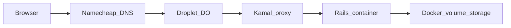

# HomeSchoolHub — Kamal on DigitalOcean + Namecheap subdomain

Deploy this Rails app with **[Kamal](https://kamal-deploy.org)** to an **existing DigitalOcean droplet**, with DNS on **Namecheap** pointing a **subdomain** at that droplet. Kamal runs **Traefik-based `kamal-proxy`** on the host, obtains **Let’s Encrypt** certificates, and routes HTTPS to your container.

**Repo wiring:** [`config/deploy.yml`](../../config/deploy.yml), [`Dockerfile`](../../Dockerfile), [`bin/kamal`](../../bin/kamal), [`.kamal/secrets`](../../.kamal/secrets). Production SQLite and Active Storage live under `storage/`, which is persisted as **`home_school_hub_storage` → `/rails/storage`** in the container.

---

## 1. How traffic flows



- **DNS** sends `your-subdomain.example.com` to the droplet’s public IP.
- **Kamal proxy** listens on **80** and **443**, terminates TLS, forwards to the app (HTTP to the container).
- **Rails** should trust the proxy and enforce HTTPS (see §7).

---

## 2. Prerequisites

| Requirement | Notes |
|-------------|--------|
| **DigitalOcean droplet** | You already have one; note its **public IPv4** (and IPv6 if you use AAAA). |
| **SSH access** | From your laptop: `ssh root@YOUR_DROPLET_IP` (or your non-root deploy user). Same user Kamal will use. |
| **Docker on the server** | First `bin/kamal setup` installs Docker if needed (per Kamal version/docs). |
| **Local tools** | Ruby + Bundler (this repo), `docker` for building/pushing images unless you use a remote builder. |
| **Container registry** | Default `deploy.yml` uses `localhost:5555` for local dev only. For real deploys use **GHCR**, **Docker Hub**, or **DigitalOcean Container Registry** (`registry.digitalocean.com/...`). |

---

## 3. DigitalOcean: firewall

On the droplet (or via **Networking → Firewalls** in DO):

- **Inbound TCP 22** — SSH (your IP or team IPs if possible).
- **Inbound TCP 80** — HTTP (Let’s Encrypt HTTP-01 challenge + redirect to HTTPS).
- **Inbound TCP 443** — HTTPS.

No need to expose the Rails container port directly; Kamal proxy publishes 80/443.

---

## 4. Namecheap: subdomain DNS

1. **Domain List** → your domain → **Manage** → **Advanced DNS**.
2. Add an **A Record**:
   - **Host:** subdomain label only (e.g. `homeschool` for `homeschool.peponi.to`).
   - **Value:** your droplet’s **public IPv4**.
   - **TTL:** Automatic, or 5–30 minutes while testing.

**Avoid conflicts:** Remove or replace any existing **A** / **AAAA** / **CNAME** on that same host that points elsewhere (parking, old host, etc.).

**Optional IPv6:** If your droplet has IPv6 and you want it, add **AAAA** with the same host label and the droplet’s IPv6.

**Verify before first deploy:**

```bash
dig +short homeschool.example.com A
```

(Replace with your real subdomain.) It should return the droplet IPv4.

---

## 5. Configure `config/deploy.yml`

Edit **[`config/deploy.yml`](../../config/deploy.yml)** on your machine (do not commit secrets or real IPs if you prefer keeping them private—use env-specific overrides or local-only edits as your team agrees).

### 5.1 Servers

Replace the placeholder with your droplet address (IP or DNS name):

```yaml
servers:
  web:
    - YOUR_DROPLET_IP_OR_HOSTNAME
```

### 5.2 Registry

Point `registry` at a real registry. Examples:

**GitHub Container Registry (ghcr.io)**

```yaml
registry:
  server: ghcr.io
  username: YOUR_GITHUB_USERNAME
  password:
    - KAMAL_REGISTRY_PASSWORD
```

Create a GitHub **Personal Access Token** with `write:packages` (and `read:packages`). Put it in [`.kamal/secrets`](../../.kamal/secrets), e.g. uncomment and set:

```bash
KAMAL_REGISTRY_PASSWORD=ghp_xxxxxxxx
```

Set `image` to **`your-user/home_school_hub`** (no `ghcr.io` prefix — Kamal combines it with `registry.server`).

**DigitalOcean Container Registry**

Use `registry.digitalocean.com/your-registry/home_school_hub` as `image`, `server: registry.digitalocean.com`, and a DO API token as the registry password (see [DO docs](https://docs.digitalocean.com/products/container-registry/)).

### 5.3 Proxy (Let’s Encrypt)

Uncomment and set **one** hostname (the same subdomain you put in DNS):

```yaml
proxy:
  ssl: true
  host: homeschool.example.com
```

If you put **Cloudflare** (or another proxy) in front of the droplet, set SSL/TLS mode to **Full (strict)** so the origin still presents a valid certificate (Kamal’s Let’s Encrypt cert on the droplet).

### 5.4 SSH user (optional)

If you deploy as non-root:

```yaml
ssh:
  user: deploy
```

Ensure that user can run Docker (often `usermod -aG docker deploy` on the server).

---

## 6. Secrets and environment variables

### 6.1 `.kamal/secrets`

[`.kamal/secrets`](../../.kamal/secrets) is loaded by Kamal; **never commit real tokens** to git. The repo already includes a safe pattern:

```bash
RAILS_MASTER_KEY=$(cat config/master.key)
```

Add registry password and any other secret **references** (1Password, `ENV`, etc.) per the comments in that file.

### 6.2 `deploy.yml` `env`

- **`RAILS_MASTER_KEY`** is already listed under `env.secret`.
- **Oak API:** add token as a secret so curriculum sync works in production, for example:

  ```yaml
  env:
    secret:
      - RAILS_MASTER_KEY
      - OAK_API_TOKEN
  ```

  Then in `.kamal/secrets`: `OAK_API_TOKEN=...`

- **Email (Brevo, recommended on DigitalOcean):** The app sends mail via **Brevo’s REST API over HTTPS (443)** so it works when [SMTP ports are blocked](https://docs.digitalocean.com/support/why-is-smtp-blocked). In [`config/deploy.yml`](../../config/deploy.yml), `env.secret` lists **`BREVO_API_KEY`** and **`MAILER_FROM`**. Add them to [`.kamal/secrets`](../../.kamal/secrets) (or export before `bin/kamal deploy`). In [Brevo](https://app.brevo.com), verify **Senders & IP** for the address used in **`MAILER_FROM`**. See [`.env.example`](../../.env.example).
  - Edit **`MAILER_HOST`** in `deploy.yml` `env.clear` to match **`proxy.host`** (public URL for mailer links).

After changing secrets, redeploy so containers pick up new values.

**Optional SMTP:** If `BREVO_API_KEY` is unset and `SMTP_ADDRESS` is set, the app still supports classic SMTP (only useful when your host allows outbound **587**).

---

## 7. Rails: SSL behind Kamal proxy

When `proxy.ssl: true` is enabled, the browser talks HTTPS to **kamal-proxy**, which talks HTTP to the app. Rails must treat the request as secure.

In **[`config/environments/production.rb`](../../config/environments/production.rb)**, uncomment (or enable):

```ruby
config.assume_ssl = true
config.force_ssl = true
```

Commit that change before or as part of going live with Kamal proxy SSL, so redirects and cookies behave correctly.

---

## 8. Deploy commands

From the **repository root** on your laptop:

```bash
bundle install
bin/kamal setup    # first time: Docker, proxy, registry login, etc. (per Kamal 2.x)
bin/kamal deploy
```

Exact subcommands may vary slightly by Kamal version; use `bin/kamal help` or [kamal-deploy.org](https://kamal-deploy.org) for the current flow.

**Smoke tests:**

```bash
curl -fI https://homeschool.example.com/up
```

Expect **200** from the health check.

**Useful aliases** (from `deploy.yml`): `bin/kamal console`, `bin/kamal logs`, `bin/kamal shell`.

---

## 9. Persistence and backups

- Docker volume **`home_school_hub_storage`** holds **`/rails/storage`** (SQLite files under `storage/*.sqlite3` and Active Storage blobs).
- **Back up** that volume (snapshots, `docker run` sidecar copy, or DO volume backups). Test a restore on a non-production droplet at least once.

---

## 10. Optional: scheduled Oak sync

Curriculum import: `bin/rails curriculum:oak_sync` (requires `OAK_API_TOKEN` in the container). Options:

- Run manually: `bin/kamal app exec -i "bin/rails curriculum:oak_sync"` (exact flags per `bin/kamal help app exec`).
- Add a **cron** on the droplet that invokes Kamal/`docker exec` (document the command you use).
- Later: dedicate a **job** host in `deploy.yml` and run Solid Queue / scheduled jobs there.

---

## 11. Troubleshooting

| Symptom | What to check |
|---------|----------------|
| Certificate fails | DNS **A** record points to this droplet; ports **80/443** open; no conflicting service on 80/443. |
| 502 / bad gateway | `bin/kamal logs`; container must listen on the port Kamal expects (this app’s **Dockerfile** targets **80**). |
| Redirect loop | `assume_ssl` / `force_ssl` misaligned with actual TLS termination—fix per §7. |
| Empty DB after “new” volume | First deploy creates fresh SQLite; run migrations (Kamal/Rails boot should run them if your image entrypoint does); run seeds if needed. |

---

## 12. Related files

| File | Role |
|------|------|
| [`config/deploy.yml`](../../config/deploy.yml) | Service name, image, servers, registry, proxy, env, volumes |
| [`Dockerfile`](../../Dockerfile) | Production image (port 80) |
| [`config/database.yml`](../../config/database.yml) | Production DB paths under `storage/` |
| [`.kamal/secrets`](../../.kamal/secrets) | `RAILS_MASTER_KEY`, registry password, app secrets |
