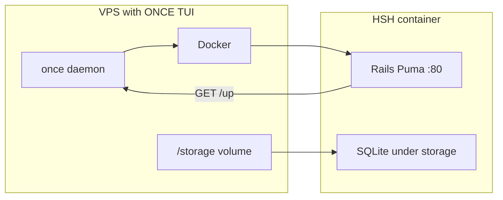

# HomeSchoolHub — ONCE.com TUI Deployment

Maps [ONCE](https://once.com) expectations to HSH actions: Docker, **port 80**, **`/up`**, persistent **`/storage`**, backups, DNS/SSL, secrets.

---

## ONCE requirement → HSH action

| ONCE requirement | HSH action |
|------------------|------------|
| **Port 80 in container** | Puma binds `0.0.0.0:80` in container; Dockerfile `EXPOSE 80`; `CMD` starts Rails/Puma on 80 (see Dockerfile fragment below). |
| **`/up` health check** | Rails 8 default **`GET /up`** — keep enabled in production; do not disable in `config/environments/production.rb`. Verify in built image with `curl -f http://127.0.0.1/up`. |
| **Persistent data under `/storage`** | Mount host/volume to container **`/storage`** (ONCE convention). Place SQLite DB (and litestack files if any) under paths included in that mount, e.g. **`/storage/rails/db/production.sqlite3`** or symlink `storage/` → under `/storage`. |
| **Rails Active Storage** | Default `config/storage.yml` disk path should live under **`/rails/storage`** or unified under **`/storage/rails/storage`** so uploads survive restarts. |
| **Backups** | Optional ONCE **`/hooks/pre-backup`**: copy SQLite safely (`sqlite3 .backup` or file copy when app quiesced); align with ONCE backup schedule in TUI. |
| **TUI / dashboard** | Install via ONCE flow: **`curl https://get.once.com`** (complete URL per current ONCE docs) — follow interactive installer. Custom apps: point TUI at **Docker image** (registry/repo:tag) or build context path ONCE expects for your version. |
| **Secrets** | **`SECRET_KEY_BASE`** set by ONCE or your env layer. **SMTP** variables ONCE injects — map in `production.rb` when enabling mailers. |

> Custom apps are often installed by **Docker image path** in the TUI, not necessarily a hand-written `once.yml` in-repo. Follow ONCE prompts and any **exported config** your ONCE version provides.

---

## Recommended deployment profile (Phase 1: one child)

For initial usage (single-family / low concurrency), use:

- Database: **SQLite**
- Persistence: **Docker named volume mounted at `/rails/storage`**
- Active Storage: write to persistent disk-backed storage under `/rails/storage`
- Health check: `GET /up`
- Container port: `80`

Rationale:

- Lowest operational complexity
- Fast setup and easy recovery
- No external DB service required
- Works well for low write contention and low concurrency

---

## Canonical storage paths (Phase 1)

Use one canonical path strategy to avoid split data:

- Keep `config/database.yml` using `storage/...` paths (already configured)
- Mount persistent volume to container path: **`/rails/storage`**
- Ensure Active Storage production service also points into `/rails/storage` (not `/tmp/storage`)

Do not mix `/storage/...` and `/rails/storage/...` in Phase 1.

---

## ONCE / container runtime checklist

1. Image exposes port 80 and app listens successfully  
2. Persistent volume mounted to `/rails/storage`  
3. `/up` returns success from inside deployment network  
4. `SECRET_KEY_BASE` configured  
5. `db:prepare` runs at boot (or equivalent migration step)  
6. Backup + restore test completed for SQLite files in volume

---

## DNS / SSL

- Point DNS A/AAAA to VPS.
- Terminate TLS at reverse proxy or ONCE edge if offered; if **Cloudflare**, use **Full (strict)** with valid origin cert.
- Ensure health checks hit **`/up`** over the same scheme/port ONCE uses internally (often HTTP inside Docker network).

### Namecheap + Netlify split (keep blog intact)

Goal:

- Keep `ng-dsgn.com` and `www.ng-dsgn.com` on Netlify unchanged
- Route only `homeschoolhub.ng-dsgn.com` to the ONCE/VPS app

In Namecheap DNS, keep existing Netlify records for host `@` and `www` as-is. Add:

- **A** record: host `homeschoolhub` → `<YOUR_VPS_IPV4>` (TTL automatic)
- Optional **AAAA** record: host `homeschoolhub` → `<YOUR_VPS_IPV6>`

Result:

- Blog remains on Netlify at `ng-dsgn.com` and `www.ng-dsgn.com`
- App serves from `homeschoolhub.ng-dsgn.com`

TLS notes:

- Issue/enable TLS cert for `homeschoolhub.ng-dsgn.com` in ONCE/proxy flow.
- Verify `https://homeschoolhub.ng-dsgn.com/up` after deploy.

---

## Dockerfile fragment (port 80)

```dockerfile
EXPOSE 80
ENV RAILS_ENV=production
# Bind Puma to 80 inside container (requires non-privileged binding or setcap — many images use PORT=80 with a non-root user via capabilities)
CMD ["./bin/rails", "server", "-b", "0.0.0.0", "-p", "80"]
```

If the image runs as non-root and cannot bind 80, use **`PORT=3000`** internally and map **host 80 → container 3000** in ONCE/docker port mapping (confirm ONCE expects app listening on 80 *inside* container per their checklist).

---

## SQLite + Litestack paths

**Example `config/database.yml` production:**

```yaml
production:
  adapter: sqlite3
  database: /storage/rails/db/production.sqlite3
  pool: <%= ENV.fetch("RAILS_MAX_THREADS") { 5 } %>
  timeout: 5000
```

Ensure **`mkdir -p`** in entrypoint for `/storage/rails/db` before boot.

**Volume layout (conceptual):**

- Host: `/var/lib/once/hsh-storage` → Container: `/storage`  
- App writes: `/storage/rails/db/*.sqlite3`, `/storage/rails/storage/*` (Active Storage)

Document **`DATABASE_URL`** override if ONCE sets it instead of `database.yml`.

---

## Environment variables (reference)

| Variable | Purpose |
|----------|---------|
| `SECRET_KEY_BASE` | Rails session/signing |
| `RAILS_LOG_LEVEL` | Optional |
| `SMTP_*` / `MAILER_*` | Devise mailers when enabled |
| `DATABASE_URL` | Optional SQLite path override |

---

## Architecture (flowchart)



---

## Pre-deploy checklist

1. Build production image locally; `curl -f http://localhost:PORT/up`  
2. Confirm SQLite directory writable on volume  
3. Run migrations in entrypoint or one-off task before traffic  
4. Set `SECRET_KEY_BASE`  
5. Configure ONCE health check → `/up`  
6. Test backup hook with SQLite copy
