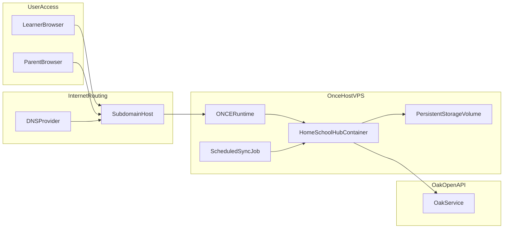

# HomeSchoolHub ONCE Subdomain Deployment Plan

## Goal
Deploy HomeSchoolHub to ONCE.com at a subdomain (template approach), so learners can use it from a browser without any shell access, and Oak content sync runs reliably in production.

## Existing Project Inputs
- Deployment reference already exists in [`docs/plan/DEPLOYMENT_ONCE.md`](docs/plan/DEPLOYMENT_ONCE.md).
- Oak sync requires `OAK_API_TOKEN` visible to the server process (not just local `.env`).
- App currently uses SQLite, so persistent volume setup is mandatory.

## Architecture (Target State)

## Phase 1: Production Baseline Hardening
- Confirm production app boot assumptions from the existing deployment guide:
  - app listens on expected port for ONCE,
  - health endpoint `/up` is reachable,
  - container can run migrations safely at deploy time.
- Confirm persisted paths for SQLite and uploads are under ONCE-mounted storage.
- Define one canonical production env var set (documented checklist):
  - required: `RAILS_ENV`, `SECRET_KEY_BASE`, `OAK_API_TOKEN`.
  - optional: mailer/logging/performance vars.

## Phase 2: Reusable Subdomain + DNS Template
- Create a reusable DNS checklist that works for any `app-subdomain.parent-domain`:
  - A/AAAA (or CNAME) record pattern,
  - TTL recommendation,
  - propagation verification steps.
- Add certificate/HTTPS validation checklist:
  - confirm cert issued for chosen subdomain,
  - verify HTTPS redirect behavior,
  - verify no mixed-content warnings.
- Add "cutover-safe" go-live flow:
  - test on temporary subdomain first,
  - then switch final public subdomain.

## Phase 3: ONCE Deployment Workflow
- Define exact ONCE deployment sequence:
  - provision app/container,
  - attach persistent volume to `/storage`,
  - set all env vars in ONCE (not `.env`),
  - run migrations,
  - run initial curriculum sync.
- Add first-run verification checks:
  - app responds on `/up`,
  - auth works over HTTPS,
  - lessons are present in DB after sync.

## Phase 4: Oak Sync Automation (No Shell for Learners)
- Add operational automation so parent/admin does not need regular shell commands:
  - scheduled daily `curriculum:oak_sync` job via ONCE cron/scheduler,
  - optional manual "sync now" admin operation for troubleshooting.
- Add monitoring/alert checklist:
  - detect failed sync,
  - check token/authorization failures,
  - verify lesson count growth/consistency.

## Phase 5: Security + Reliability Controls
- Secret handling:
  - keep `OAK_API_TOKEN` and `SECRET_KEY_BASE` only in ONCE secret/env management,
  - never commit `.env` or secrets to git.
- Backup and recovery:
  - ensure SQLite backups are covered by ONCE backup strategy,
  - define restore smoke test steps.
- Access safety:
  - parent admin account recovery path,
  - optional basic rate limiting / login hardening review.

## Phase 6: Go-Live Runbook
- Final pre-launch checks:
  - domain resolves,
  - HTTPS valid,
  - login + lesson rendering works on mobile and desktop,
  - sync job has run successfully at least once.
- Launch checklist:
  - switch DNS to final subdomain,
  - announce URL to learner,
  - monitor logs and health for first 24 hours.
- Post-launch weekly maintenance checklist:
  - confirm backups,
  - verify sync recency,
  - apply dependency/security updates on a cadence.

## Deliverables to Prepare Next Session
- A single production runbook markdown file with:
  - copy/paste ONCE env var checklist,
  - reusable DNS record template,
  - initial deploy command sequence,
  - rollback + recovery steps.
- Optional follow-up implementation plan:
  - in-app admin "Sync now" button,
  - status page showing token presence, last sync time, lesson counts.
